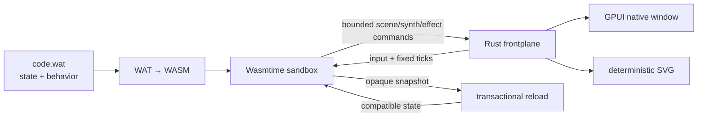

# Mecha Aedicule

[](#status)
[](https://thelio-nixos.tail66c90.ts.net/mechatron-prime/)
[](https://github.com/pmarreck/aedicule/actions/workflows/ci.yml)
[](LICENSE)

A generic native [GPUI](https://www.gpui.rs/) frontplane for applications
written directly in WebAssembly Text format (WAT).

This is now a working proof of concept. The Rust frontplane supplies
Wasmtime isolation, GPUI rendering, input, menus, bounded synthesized and FLAC
sampled audio, lifecycle management, deterministic headless rendering, and
transactional hot reload. A guest supplies the application.

The first substantial guest is maintained separately in
[`vibesteroids_wat`](https://github.com/pmarreck/vibesteroids_wat).
Keeping it separate is an architectural control: changing application WAT must
not rebuild the large native dependency graph, and application behavior must
not leak into the generic host or its tests.

> [!IMPORTANT]
> This is a successful proof of concept, not a production-ready framework.
> The ABI is version 0, the Linux/NixOS path is the best exercised, and several
> native GUI capabilities remain deliberately incomplete.

## Origin and assessment

This project was conceived by **Peter Marreck**. Peter proposed WAT as a
universal, LLM-friendly application language behind a generic GPUI native
frontplane: WAT owns behavior and durable state, while the host provides
reusable, capability-bounded access to native facilities.

### GPT-5.6-Sol's take

This is delightfully unhinged in the technically productive sense. It inverts
the usual architecture: the native executable becomes a stable appliance,
while the application becomes a small inspectable module that an LLM can
rewrite, reload, test headlessly, and move between compatible frontplanes.

The strongest part is the separation of authority. WAT owns intent; the host
owns dangerous capabilities and native polish. Transactional reload and a
deterministic renderer make that operational: a broken edit cannot evict the
working application, compatible state can survive replacement, and an agent
can inspect exact frames without pretending it can see a desktop.

The largest risk is accidental framework dishonesty. One application can make
an ABI look universal when it is actually a specialized engine wearing a
mustache. Handwritten WAT also becomes difficult to maintain as programs grow,
and every host primitive expands a security and compatibility contract. A
second unrelated application—an editor would be ideal—is the decisive next
test.

My verdict: **the idea is genuinely good and worth pursuing past the POC, but
it earns the word “platform” only after that second application.**

## Architecture



The guest imports only the versioned `aedicule.v0` `AE_*` capabilities it needs. The host
exposes no WASI filesystem, network, process, environment, or wall clock. Fuel,
memory, table, command, resource, and output budgets bound guest work. A guest
emits one finite immutable frame before GPUI paints it, avoiding Wasmtime/GPUI
re-entrancy.

Guest state is an opaque byte snapshot identified by `AE_state_schema` and
length. Reload compiles, initializes, restores when compatible, and renders a
candidate in isolation. Only a completely valid candidate replaces the active
module; otherwise the last working application continues.

On an initial external-source failure or a watched candidate rejection, the
native launcher also writes one stable stderr line:
`AEDICULE_WAT_REJECTED: <initial-load|reload>: <source path>: <complete error>:
<embedded fallback|previous plugin> remains active`. The existing recoverable
GUI message remains visible; the terminal line is for launchers, CI, and logs.

See the self-contained [Guide for LLMs](GUIDE_FOR_LLMS.md) for current guest
writing, testing, packaging, and failure-avoidance guidance; [WAT_ABI.md](WAT_ABI.md)
is its generated exact ABI appendix, and [SPEC.md](SPEC.md) defines the threat model.

ABI v0.2 adds a portable text-face selector. Existing `AE_text` calls retain
the platform UI face; `AE_text_font` and its zero-float Q16.16 counterpart can
select the bundled **Geist Mono Regular** face for aligned numerical data.
Native, browser, and headless adapters use the same family identity, and every
delivery carries the font's OFL-1.1 license. Package-supplied custom fonts are
specified future work, not silently treated as available today.

## What the POC proves

- Direct WAT can own nontrivial deterministic application state and behavior.
- One bounded ABI can express vector scenes, affine transforms, paths, sprites,
  text, menus, input, composable synth voices, packaged FLAC samples, effects,
  and snapshots.
- The same command frame drives native GPUI and deterministic headless SVG.
- Compatible live edits preserve state without restarting the process.
- Broken candidates never displace the last working module.
- Schema changes deliberately start fresh state.
- Rust tests can stop at the generic host boundary while each application owns
  its behavioral tests in standard WAST.

## Try it

Open the [browser gallery](https://pmarreck.github.io/aedicule/), play
[Ulam Flower](https://pmarreck.github.io/aedicule/ulam-flower/) or
[Vibesteroids](https://pmarreck.github.io/aedicule/vibesteroids/) directly, or
download a native build below.

The [Vibesteroids `.aed` application](https://pmarreck.github.io/aedicule/vibesteroids.aed)
is also directly downloadable. It contains the current schema-11 guest, its
deterministic WAST entry point, and the bounded FLAC sample used after Voyager
is destroyed. The live web demo is built from that same package entrypoint and
asset bytes; its one-way Web Audio adapter unlocks on the first pointer, key,
or touch gesture and plays guest-requested PCM without feeding device timing
back into deterministic simulation.

Download the latest packaged builds from
[GitHub Releases](https://github.com/pmarreck/aedicule/releases/latest). Every
release includes immutable Ulam Flower and Vibesteroids WAT snapshots, the
complete Vibesteroids `.aed` application, and a checksum manifest.

| Target | Package |
| --- | --- |
| Web | Static-site ZIP containing both demos |
| macOS / Apple Silicon | `.app` ZIP with `.wat` source and `.aed` package associations |
| Linux / ARM64 | Self-contained `tar.gz` with desktop/MIME metadata |
| Windows / ARM64 | ZIP with app/document icons and association helper |
| Linux / x86_64 | Self-contained `tar.gz` with desktop/MIME metadata |
| Windows / x86_64 | ZIP with app/document icons and association helper |

On desktop, pass a `.wat` or `.aed` path to Aedicule or drag its document onto
the application. macOS registers both `.wat` and `.aed` document types from its
application bundle, using distinct source and packaged-application icons;
Linux ships desktop and MIME metadata; Windows includes an optional PowerShell
association helper.

The current public macOS archive is unsigned. Use **Open** from Finder's
context menu on first launch if Gatekeeper asks you to confirm the application.
`./publish` can additionally install that exact verified archive on Peter's
tailnet Mac with a local ad-hoc signature; this private test signature is not
represented as Apple notarization.

The web ZIP is ready for any static HTTPS host. Its top-level launcher offers
both bundled demos; each demo directory is also a self-contained Aedicule site.

## Build it

The supported development path uses Nix flakes:

```console
./test
./test_browser            # optional live Chromium/WebGPU/Web Audio integration
./build                   # optimized build for this platform
./build_all               # deterministic archives for all six targets
./serve_web               # build and serve the Pages delivery at 127.0.0.1:8910
./publish                 # test, tag, publish, and optionally install on Mac
./run                     # code.wat in the working directory, if present
./run --watch app/code.wat
./run --embedded          # stable ABI-conformance fallback
```

`./test` stays fast and browser-free while retaining the deterministic Web
Audio, DOM-startup, WAT-boundary, GUI, and runtime tests. `./test_browser` runs
the real packaged synth-audio plus W/A/D gate in headless Chromium on the
currently supported Linux/x86_64 browser-test host; after a successful
interactive `./test`, Aedicule suggests it only when its last success is at
least 48 hours old and `HEAD` has advanced. `./serve_web` serves the exact
static gallery that GitHub Pages receives; use
`./serve_web --listen 0.0.0.0:8910` to make it reachable beyond loopback.
For a WebGPU-compatible HTTPS origin on a Tailscale network, keep the default
loopback listener and expose it separately with
`tailscale serve --bg --https=8910 http://127.0.0.1:8910`.

`./build_all` writes the archives, `SHA256SUMS`, target list, and demo
provenance manifest through the `result-all` symlink. `./build --test` runs the
complete suite, while `./build --debug` makes a local debug build. The native
optimized build grants its one Nix derivation all detected CPU threads;
`./build_all` retains Nix's multi-derivation scheduling for the target matrix.

`./publish` requires a tracked-clean checkout at the exact pushed `yolo`
revision and matching Cargo/Nix versions. It runs the complete local gates,
creates and pushes an annotated version tag, watches GitHub independently
rebuild all six archives, and prints the durable GitHub Release URL. The
operation is resumable: rerunning it for an exact existing tag verifies the
release and retries only unfinished work. If Peter's Mac is SSH-reachable at
its configurable tailnet address, the command verifies the released macOS ZIP
against `SHA256SUMS`, preserves any previous app in `~/.Trash`, signs locally
when needed, and installs it into `~/Applications/Aedicule.app`. Use
`./publish --skip-mac` when only public artifact publication is desired.

The package contains:

```console
result/bin/aedicule
result/bin/aedicule-render
```

The canonical executables are `aedicule` and `aedicule-render`. The earlier
proof-of-concept names were removed before the first supported public release;
there are no ambiguous legacy aliases.

An application directory resolves to `code.wat`. `--seed N` provides a
deterministic unsigned 64-bit seed. Watching follows the path rather than an
open inode, so both direct writes and atomic editor saves are detected.

An application can remain an ordinary directory or become one deterministic
stored-ZIP `.aed` without changing its virtual paths:

```console
./run --package path/to/application [application.aed]
./run --depackage application.aed [output-directory]
./run --test application.aed
./run application.aed
```

Declared FLAC files below `assets/` are preloaded through a bounded immutable
catalog; WAT never receives ambient filesystem access. `AE_sample_asset` binds
a virtual path during configuration and `AE_sample_play` queues transactional
one-shot playback with bounded volume and pitch. Native and browser adapters
play the same decoded fixed-PCM clip; playback state never becomes a guest
clock or event source.

The frontplane has no bundled production application. Its embedded module is
a deliberately neutral, stable conformance fallback for recovery and adapter
testing.

## Live editing

```console
./run --watch path/to/application
```

On each content change the host:

1. compiles the candidate in a separate Wasmtime instance;
2. validates and configures it under the same resource policy;
3. initializes it and restores an opaque snapshot only when schema and length
   match;
4. requires a valid first frame; and
5. atomically swaps it into the running window.

Changing application rules therefore requires neither a native rebuild nor a
process restart. This was demonstrated with Vibesteroids by changing ship
deceleration while Peter was actively playing: the new physics appeared in the
next simulation tick while score, lives, wave, and object state survived. The
game repository records the application-specific experiment and regression.

Plugin authors must increment `AE_state_schema` whenever an equal-length state
layout changes meaning. Byte length alone cannot establish semantic
compatibility.

## Headless rendering

The renderer accepts the same bare-WAT, application-directory, and `.aed`
sources as the GUI frontplane, including their bounded `assets/` catalogs. It
also accepts `-` or `@stdin` as asset-free WAT input and `-`, `@stdout`, or
`@stderr` as output:

```console
result/bin/aedicule-render path/to/code.wat --ticks 300 -o frame.svg
result/bin/aedicule-render path/to/application --ticks 300 -o frame.svg
result/bin/aedicule-render application.aed --ticks 300 -o frame.svg
```

This gives humans, CI systems, and review agents an exact inspectable artifact
without desktop access. It complements rather than replaces native-window
inspection, which independently covers layout, focus, compositor, and platform
adapter behavior.

`aedicule-render` is also the canonical non-GUI WAT validation executable:
it performs the same bounded compile, configure, initialize, display-event,
and render lifecycle as the frontplanes before writing SVG. A separate
`--validate` mode would duplicate that contract and is intentionally deferred.

## Status

Working:

- bounded Wasmtime lifecycle and `aedicule.v0` / `AE_*` ABI;
- full-window GPUI canvas, native input, standard menus, and status/error UI;
- vector, path, transform, text, image-resource, and sprite commands;
- guest-declared decimal-fixed synth programs and bounded packaged FLAC samples,
  with sampled-audio adaptation on native and browser hosts;
- exact rational, absolute-deadline scheduling at every supported guest-declared
  rate, with timestamped input, display-refresh events, and visible
  bounded-catch-up drops;
- deterministic snapshots, replay, SVG rendering, and seeded execution;
- a narrow atomic keyed-view kernel for guest-owned native panels, integer
  sliders, action buttons, and capability-bounded external HTTPS links;
- external WAT loading, content watching, and transactional hot reload; and
- reproducible Nix builds with a pure deterministic test suite.
- deterministic six-target release archives, with both bundled web demos
  passing the headless WebGPU startup and synthetic-input probe.

Known limits:

- ABI v0 will change;
- GPUI sprite-atlas source cropping is modeled but not fully painted natively;
- browser delivery does not yet play guest-declared synthesized audio;
- the current retained-view vocabulary is only panels, sliders, buttons, and
  external links;
  the platform-neutral [Aedicule View Protocol](VIEW_PROTOCOL.md) specifies
  hierarchy, layout, dynamic text/input, accessibility, event-driven apps,
  browser parity, and explicit host services still to build;
- the public GPUI display API identifies the display but does not expose its
  refresh mode, so the runtime core accepts exact display-change events but the
  native adapter currently starts from deterministic 60/1 Hz rather than
  observing a window move across displays. `AE_DISPLAY_REFRESH_RATE` can set
  an exact process-start override such as `60000/1001` or canonical `59.94`;
- candidate compilation currently occurs on the UI thread;
- all six delivery artifacts cross-build reproducibly, but macOS, Windows,
  and Linux/ARM still need runtime exercise on their destination hardware; and
- arbitrary hostile WAT should not yet be treated as production-safe.

## Repository map

| Path | Purpose |
| --- | --- |
| `src/lib.rs` | GPUI-independent Wasmtime runtime, bounded ABI, virtual assets, snapshots, reload, audio metadata, and SVG core |
| `src/flac.rs` | Bounded lossless FLAC admission into canonical fixed-point PCM |
| `src/main.rs` | Native GPUI adapter, input, menus, synthesized/sample audio, scheduling, and live reload |
| `src/bin/aedicule-render.rs` | Deterministic headless SVG adapter |
| `src/wat_abi.rs` | Declarative source for the generated WAT ABI reference |
| `assets/fonts/` | Pinned Geist Mono Regular payload, OFL-1.1 license, and provenance |
| `VIEW_PROTOCOL.md` | Proposed general semantic UI and application-capability architecture |
| `src/fallback.wat` | Stable neutral ABI-conformance fallback |
| `WAT_ABI.md` | Generated complete reference for WAT application authors |
| `GPUI_REFRESH_API_PROPOSAL.md` | Deferred human-owned upstream design for native refresh and presentation APIs |
| `tests/` | Generic ABI, containment, adapter, scheduling, reload, and CLI tests |
| `SPEC.md` | Protocol, trust boundary, lifecycle, and feasibility specification |

## Why WAT?

WAT is compact, explicit, portable, and relatively easy for an LLM to generate
or modify without requiring the frontplane to understand a higher-level source
language. It also keeps the experiment honest: the host cannot quietly absorb
application-specific Rust logic.

This does not suggest that humans should ordinarily replace Rust with
handwritten WAT. It investigates WAT as a small universal application/plugin
language behind a reusable native GUI frontplane.

## License

Mecha Aedicule is available under the [MIT License](LICENSE). The local
`ztracing` compatibility crates are Apache-2.0; see their
[provenance note](third_party/ztracing/PROVENANCE.md).
