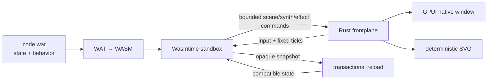

# Mecha Aedicule

[](#status)
[](https://github.com/pmarreck/aedicule/actions/workflows/ci.yml)
[](LICENSE)

A generic native [GPUI](https://www.gpui.rs/) frontplane for applications
written directly in WebAssembly Text format (WAT).

Mecha Aedicule asks a slightly strange but useful question:

> Can a small, capability-bounded WAT module own an application's state and
> behavior while a reusable Rust host supplies a polished native window?

The answer is now a working proof of concept. The Rust frontplane supplies
Wasmtime isolation, GPUI rendering, input, menus, bounded audio synthesis,
lifecycle management, deterministic headless rendering, and transactional hot
reload. A guest supplies the application.

The first substantial guest is maintained separately in
[Vibesteroids Aedicule](https://github.com/pmarreck/vibesteroids-aedicule).
Keeping it separate is an architectural control: changing application WAT must
not rebuild the large native dependency graph, and application behavior must
not leak into the generic host or its tests.

> [!IMPORTANT]
> This is a successful proof of concept, not a production-ready framework.
> The ABI is version 0, the Linux/NixOS path is the best exercised, and several
> native GUI capabilities remain deliberately incomplete.

## Origin and assessment

This project was conceived by **Peter Marreck**. Peter proposed WAT as a
universal, LLM-friendly application language behind a generic GPUI native
frontplane: WAT owns behavior and durable state, while the host provides
reusable, capability-bounded access to native facilities.

### GPT-5.6-Sol's take

This is delightfully unhinged in the technically productive sense. It inverts
the usual architecture: the native executable becomes a stable appliance,
while the application becomes a small inspectable module that an LLM can
rewrite, reload, test headlessly, and move between compatible frontplanes.

The strongest part is the separation of authority. WAT owns intent; the host
owns dangerous capabilities and native polish. Transactional reload and a
deterministic renderer make that operational: a broken edit cannot evict the
working application, compatible state can survive replacement, and an agent
can inspect exact frames without pretending it can see a desktop.

The largest risk is accidental framework dishonesty. One application can make
an ABI look universal when it is actually a specialized engine wearing a
mustache. Handwritten WAT also becomes difficult to maintain as programs grow,
and every host primitive expands a security and compatibility contract. A
second unrelated application—an editor would be ideal—is the decisive next
test.

My verdict: **the idea is genuinely good and worth pursuing past the POC, but
it earns the word “platform” only after that second application.**

## Architecture



The guest imports only the versioned `host.v0` capabilities it needs. The host
exposes no WASI filesystem, network, process, environment, or wall clock. Fuel,
memory, table, command, resource, and output budgets bound guest work. A guest
emits one finite immutable frame before GPUI paints it, avoiding Wasmtime/GPUI
re-entrancy.

Guest state is an opaque byte snapshot identified by `fp_state_schema` and
length. Reload compiles, initializes, restores when compatible, and renders a
candidate in isolation. Only a completely valid candidate replaces the active
module; otherwise the last working application continues.

See [SPEC.md](SPEC.md) for the ABI and threat model.

## What the POC proves

- Direct WAT can own nontrivial deterministic application state and behavior.
- One bounded ABI can express vector scenes, affine transforms, paths, sprites,
  text, menus, input, composable synth voices, effects, and snapshots.
- The same command frame drives native GPUI and deterministic headless SVG.
- Compatible live edits preserve state without restarting the process.
- Broken candidates never displace the last working module.
- Schema changes deliberately start fresh state.
- Rust tests can stop at the generic host boundary while each application owns
  its behavioral tests in standard WAST.

## Try it

The supported development path uses Nix flakes:

```console
./test
./build
./run                     # code.wat in the working directory, if present
./run --watch app/code.wat
./run --embedded          # stable ABI-conformance fallback
```

The package contains:

```console
result/bin/gpui-wasm
result/bin/gpui-wasm-render
```

The provisional binary names remain `gpui-wasm` to avoid mixing repository
separation with a public CLI migration. They may change before ABI v1.

An application directory resolves to `code.wat`. `--seed N` provides a
deterministic unsigned 64-bit seed. Watching follows the path rather than an
open inode, so both direct writes and atomic editor saves are detected.

The frontplane has no bundled production application. Its embedded module is
a deliberately neutral, stable conformance fallback for recovery and adapter
testing.

## Live editing

```console
./run --watch path/to/application
```

On each content change the host:

1. compiles the candidate in a separate Wasmtime instance;
2. validates and configures it under the same resource policy;
3. initializes it and restores an opaque snapshot only when schema and length
   match;
4. requires a valid first frame; and
5. atomically swaps it into the running window.

Changing application rules therefore requires neither a native rebuild nor a
process restart. This was demonstrated with Vibesteroids by changing ship
deceleration while Peter was actively playing: the new physics appeared in the
next simulation tick while score, lives, wave, and object state survived. The
game repository records the application-specific experiment and regression.

Plugin authors must increment `fp_state_schema` whenever an equal-length state
layout changes meaning. Byte length alone cannot establish semantic
compatibility.

## Headless rendering

The renderer accepts `-` or `@stdin` as WAT input and `-`, `@stdout`, or
`@stderr` as output:

```console
result/bin/gpui-wasm-render path/to/code.wat --ticks 300 -o frame.svg
```

This gives humans, CI systems, and review agents an exact inspectable artifact
without desktop access. It complements rather than replaces native-window
inspection, which independently covers layout, focus, compositor, and platform
adapter behavior.

## Status

Working:

- bounded Wasmtime lifecycle and `host.v0` ABI;
- full-window GPUI canvas, native input, standard menus, and status/error UI;
- vector, path, transform, text, image-resource, and sprite commands;
- guest-declared decimal-fixed synth programs with audio-device adaptation;
- exact rational fixed-step accumulation and plugin-declared tick rates;
- deterministic snapshots, replay, SVG rendering, and seeded execution;
- external WAT loading, content watching, and transactional hot reload; and
- reproducible Nix builds with a pure deterministic test suite.

Known limits:

- ABI v0 will change;
- GPUI sprite-atlas source cropping is modeled but not fully painted natively;
- retained widgets, accessibility semantics, clipping, and richer images need
  further protocol and adapter work;
- candidate compilation currently occurs on the UI thread;
- platform parity beyond x86_64 Linux is unproven; and
- arbitrary hostile WAT should not yet be treated as production-safe.

## Repository map

| Path | Purpose |
| --- | --- |
| `src/lib.rs` | GPUI-independent Wasmtime runtime, bounded ABI, snapshots, reload, synth metadata, and SVG core |
| `src/main.rs` | Native GPUI adapter, input, menus, audio, scheduling, and live reload |
| `src/bin/gpui-wasm-render.rs` | Deterministic headless SVG adapter |
| `src/fallback.wat` | Stable neutral ABI-conformance fallback |
| `tests/` | Generic ABI, containment, adapter, scheduling, reload, and CLI tests |
| `SPEC.md` | Protocol, trust boundary, lifecycle, and feasibility specification |

## Why WAT?

WAT is compact, explicit, portable, and relatively easy for an LLM to generate
or modify without requiring the frontplane to understand a higher-level source
language. It also keeps the experiment honest: the host cannot quietly absorb
application-specific Rust logic.

This does not suggest that humans should ordinarily replace Rust with
handwritten WAT. It investigates WAT as a small universal application/plugin
language behind a reusable native GUI frontplane.

## License

Mecha Aedicule is available under the [MIT License](LICENSE). The local
`ztracing` compatibility crates are Apache-2.0; see their
[provenance note](third_party/ztracing/PROVENANCE.md).
