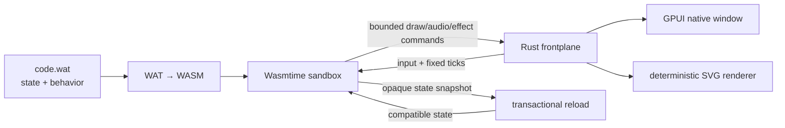

# gpui-wasm

[](#project-status)
[](https://github.com/pmarreck/gpui-wasm/actions/workflows/ci.yml)
[](LICENSE)

A generic native [GPUI](https://www.gpui.rs/) frontplane for applications
written directly in WebAssembly Text format (WAT).

The experiment asks a slightly strange but useful question:

> Can a small, capability-bounded WAT module own an application's state and
> behavior while a reusable Rust host supplies a polished native window?

The bundled answer is a playable Asteroids-style game based on
[Vibesteroids](https://github.com/pmarreck/vibesteroids). Its simulation,
game state, drawing decisions, menus, and audio events live in WAT. The generic
Rust host supplies Wasmtime isolation, GPUI rendering, native input and menus,
generated audio, lifecycle management, and transactional hot reload.

> [!IMPORTANT]
> **This is a successful proof of concept, not a production-ready application
> framework.** The core idea works and the demo is playable, but the ABI is
> explicitly version 0, important GUI primitives remain incomplete, and only
> the Linux/NixOS path has been exercised thoroughly.

## Origin and assessment

This project was conceived by **Peter Marreck**. Peter proposed using WAT as a
universal, LLM-friendly application language behind a generic GPUI native
frontplane: the WAT module would own the application's behavior and durable
state, while the host would provide reusable, capability-bounded access to
windowing, input, rendering, audio, menus, storage, and other platform
facilities.

### GPT-5.6-Sol's take

This is delightfully unhinged in the technically productive sense. It is not
merely “put a game in WebAssembly.” It inverts the usual application
architecture: the native executable becomes a generic, stable appliance, while
the application itself becomes a small inspectable module that an LLM can
rewrite, reload, test headlessly, and move between compatible frontplanes.

The strongest part of Peter's idea is the separation of authority. WAT owns
intent, state, and behavior; the host owns dangerous capabilities and native
polish. The transactional reload and deterministic headless renderer turn that
from an interesting diagram into something operational: a broken edit cannot
evict the working application, compatible state can survive code replacement,
and an agent can inspect exact frames without pretending it can see a desktop.

The largest risk is accidental framework dishonesty. One Asteroids game can
make an ABI look universal when it is actually a game engine wearing a
mustache. Handwritten WAT also becomes difficult to maintain as programs grow,
and every new host primitive expands a security and compatibility contract.
The decisive next experiment is therefore a second, unrelated application—an
editor would be ideal—implemented without smuggling its business logic into
Rust.

My verdict: **the idea is genuinely good and worth pursuing past the POC, but
it earns the word “platform” only after that second application.** Asteroids
proves the machine runs; an editor would prove Peter found an architecture.

## The architecture



The trust boundary is deliberately narrow:

- the guest imports only the versioned `host.v0` capabilities it needs;
- no WASI filesystem, network, process, clock, or environment access is
  exposed;
- Wasmtime fuel and memory/table/output budgets bound each guest call;
- the guest emits a finite immutable command buffer before GPUI paints it; and
- snapshots are opaque bytes whose compatibility is declared by the guest's
  `fp_state_schema`.

This is still defense-in-depth research, not a claim that arbitrary hostile
WAT is production-safe.

## What the POC proves

- Directly authored WAT can hold a nontrivial deterministic game simulation.
- One generic ABI can cover vector drawing, affine transforms, paths, sprites,
  text, menus, input, audio events, host effects, and snapshots.
- The same guest output can drive both a native GPUI window and a deterministic
  headless SVG artifact.
- Live edits can replace code without restarting compatible game state.
- A malformed replacement never displaces the last working plugin.
- A changed state schema deliberately restarts with fresh state.
- Headless tests can independently exercise lifecycle, determinism, rendering,
  hostile inputs, resource limits, and reload behavior.

## Project status

Working now:

- playable Vibesteroids behavioral conversion with a score/level/lives HUD,
  five-rock opening wave, jagged rotating asteroids, multi-shot firing,
  two-child splitting, 80/120 scoring, escalating waves, particles, ship
  debris, respawn, and game over;
- deterministic fixed-capacity WAT pools for 32 asteroids, 64 bullets, 150
  particles, and four debris pieces;
- native GPUI/gpui-component window;
- keyboard controls and native menus;
- generated semantic audio;
- deterministic headless SVG output;
- external WAT file/application-directory loading;
- `--watch`, Reload, and Ctrl+R hot reload;
- state-preserving transactional replacement; and
- reproducible Nix build with a deterministic test suite.

Not yet production-ready:

- the `gpui-frontplane-v0` ABI will change;
- GPUI sprite-atlas source cropping is represented in the core but the native
  adapter currently draws a destination outline;
- retained widgets, accessibility semantics, clipping, richer image handling,
  and application-defined native actions remain future work;
- candidate compilation currently happens synchronously on the UI thread;
- the GPUI/Zed dependency graph makes clean builds unusually large and slow;
  and
- macOS and other platform paths are architectural goals, not yet equivalent
  to the tested x86_64 Linux implementation.

See [SPEC.md](SPEC.md) for the ABI, threat model, design decisions, and honest
spike boundaries. [VIBESTEROIDS_BEHAVIOR_SPEC.md](VIBESTEROIDS_BEHAVIOR_SPEC.md)
documents the original browser game's source-derived algorithms, constants,
quirks, and the staged WAT conversion policy.

## Try it

The supported development path uses [Nix](https://nixos.org/) with flakes:

```console
./test       # full deterministic test suite
./build      # optimized reproducible Nix package
./run        # optimized local launch with the embedded demo
```

The built package contains two executables:

```console
result/bin/gpui-wasm
result/bin/gpui-wasm-render --ticks 300 -o frame.svg
```

Vibesteroids controls:

| Input | Action |
| --- | --- |
| Left / Right | Rotate |
| Up | Thrust |
| Space | Fire |
| P | Pause |
| R | New game |
| Ctrl+R | Reload external WAT |

New Game, Reload, and Quit are also available through the window chrome and
native menu.

## Live-edit a WAT application

By convention the frontplane looks for `code.wat` in the working directory:

```console
cp plugins/vibesteroids.wat code.wat
./run --watch
```

You can instead select a file or an application directory:

```console
./run path/to/game.wat
./run --watch path/to/application
./run --embedded
```

An application directory resolves to `path/to/application/code.wat`. Watching
follows the path rather than an open inode, so ordinary writes and atomic
editor rename/replacement saves are both detected.

Reload is transactional. A candidate must compile, configure, initialize,
restore when compatible, and render its first frame successfully before it
replaces the active module. Matching `fp_state_schema` values and snapshot byte
lengths preserve state. A mismatch starts fresh state. Any other failure leaves
the previous application running and displays a recoverable error.

Because snapshot bytes are intentionally opaque, plugin authors must increment
`fp_state_schema` whenever an equal-length state layout changes meaning.

### We changed the physics of a running game

On July 16, 2026, we launched the optimized native frontplane with its external
Vibesteroids WAT file under observation:

```console
result/bin/gpui-wasm --watch plugins/vibesteroids.wat
```

While Peter was flying the ship, we removed these two operations from the
guest's `$update_live_ship` function:

```wat
i32.const 1048 i32.const 1048 f32.load f32.const 0.99 f32.mul f32.store
i32.const 1052 i32.const 1052 f32.load f32.const 0.99 f32.mul f32.store
```

They multiplied horizontal and vertical velocity by `0.99` on every simulation
tick—the original game's deliberately arcade-like drag. Deleting them first
changed the rule to inertial coasting: thrust changed velocity, but merely
releasing thrust did not. Peter saw that change immediately and then asked to
dial a little deceleration back in. We restored the same operations with a
`0.995` coefficient, reducing the per-tick velocity loss from 1% to 0.5% in a
second live edit. The final regression test injects velocities `2.5` and
`-1.25`, advances exactly one tick without thrust, and requires `2.4875` and
`-1.24375` respectively.

Both visible results arrived in the already-running GPUI window: first the ship
stopped slowing down entirely, then it acquired the gentler drag. The window did
not close, the Rust host was not recompiled, the process was not restarted, and
the current score, lives, wave, ship, bullets, asteroids, and other game state
survived both edits.

That worked because the watcher does not blindly replace the live module:

1. It detected the saved WAT file and compiled a candidate WASM module.
2. It configured and initialized the candidate in a separate Wasmtime instance.
3. It compared the candidate's `fp_state_schema` and state length with the live
   module (`schema 2`, 8192 bytes for this edit).
4. It restored the live snapshot into the compatible candidate.
5. It required the candidate to render a valid first frame within all host
   limits.
6. Only then did it atomically swap the proven candidate into the window.

The old module remains active until every step succeeds. Broken WAT, rejected
commands, exhausted budgets, failed state restoration, or an invalid first
frame therefore leave the running game untouched. An intentional schema change
takes the other safe path and starts a fresh game. This small physics edit is a
concrete demonstration of the larger idea: application behavior can change in
human-visible real time while a stable native frontplane preserves compatible
application state.

## Headless rendering

`gpui-wasm-render` runs the same frontplane core without opening a window. It
accepts `-` or `@stdin` as WAT input and `-`, `@stdout`, or `@stderr` as output:

```console
result/bin/gpui-wasm-render plugins/vibesteroids.wat \
	--ticks 300 \
	-o frame.svg
```

This gives CI systems, review agents, image converters, and visual-regression
tools an exact inspectable artifact without requiring desktop access.

## Repository map

| Path | Purpose |
| --- | --- |
| `plugins/vibesteroids.wat` | WAT-owned game state, simulation, menus, rendering, and audio events |
| `src/lib.rs` | GPUI-independent Wasmtime runtime, validation, command model, snapshots, and reload core |
| `src/main.rs` | Native GPUI renderer, input, menus, audio, and live-file adapter |
| `src/bin/gpui-wasm-render.rs` | Deterministic headless SVG adapter |
| `tests/` | ABI, containment, rendering, CLI, launch, and hot-reload coverage |
| `SPEC.md` | Protocol specification and feasibility findings |
| `VIBESTEROIDS_BEHAVIOR_SPEC.md` | Source-derived original-game behavior and staged WAT port plan |
| `PROJECT_OVERVIEW.md` | Project goals and terminology |

## Why WAT?

WAT is compact, explicit, portable, and relatively easy for an LLM to generate
or modify without requiring the frontplane to understand a higher-level source
language. It also keeps the experiment honest: the generic host cannot quietly
absorb application-specific Rust logic.

This project does **not** suggest that humans should ordinarily replace Rust
with handwritten WAT. It investigates whether WAT can serve as a small
universal plugin language behind a reusable native GUI frontplane.

## License

gpui-wasm is available under the [MIT License](LICENSE).

The local `ztracing` compatibility crates are Apache-2.0 and replace a GPL-only
optional instrumentation path that GPUI does not use in its default mode; see
their [provenance note](third_party/ztracing/PROVENANCE.md).
